# Architecture Diagram — End-to-End Data Flow

## CSV → Bronze → Silver → Gold Pipeline

```mermaid
flowchart LR
    subgraph SRC["Source Files (Local CSV)"]
        S1["Sales Data 2020.csv"]
        S2["Sales Data 2021.csv"]
        S3["Sales Data 2022.csv"]
        S4["Customer Lookup.csv"]
        S5["Product Lookup.csv"]
        S6["Product Categories Lookup.csv"]
        S7["Subcategories Lookup.csv"]
        S8["Calendar Lookup.csv"]
        S9["Territory Lookup.csv"]
        S10["Returns Data.csv"]
    end

    subgraph BRONZE["ADVENTURE_WORKS_DB.BRONZE (RAW Layer)"]
        B1["BRONZE_SALES_2020"]
        B2["BRONZE_SALES_2021"]
        B3["BRONZE_SALES_2022"]
        B4["BRONZE_CUSTOMER"]
        B5["BRONZE_PRODUCT"]
        B6["BRONZE_PRODUCT_CATEGORY"]
        B7["BRONZE_SUBCATEGORY"]
        B8["BRONZE_CALENDAR"]
        B9["BRONZE_TERRITORY"]
        B10["BRONZE_RETURNS"]
    end

    subgraph SILVER["ADVENTURE_WORKS_DB.SILVER (CURATED Layer)"]
        SV1["SILVER_SALES\n(merged 2020-2022 + enriched)"]
        SV2["SILVER_CUSTOMER\n(cleansed + income band)"]
        SV3["SILVER_PRODUCT\n(with category/subcategory)"]
        SV4["SILVER_RETURNS\n(joined to products)"]
    end

    subgraph GOLD["ADVENTURE_WORKS_DB.GOLD (ANALYTICS Layer)"]
        G1["FACT_SALES"]
        G2["FACT_RETURNS"]
        G3["DIM_CUSTOMER"]
        G4["DIM_PRODUCT"]
        G5["DIM_PRODUCT_CATEGORY"]
        G6["DIM_PRODUCT_SUBCATEGORY"]
        G7["DIM_CALENDAR"]
        G8["DIM_TERRITORY"]
    end

    subgraph VIEWS["Analytical Views"]
        V1["vw_SalesByPeriod"]
        V2["vw_CustomerPerformance"]
    end

    SRC --> |"load_to_bronze.py\n(Snowflake connector)"| BRONZE
    BRONZE --> |"transform_to_silver.py\n(cleanse, join, derive)"| SILVER
    SILVER --> |"load_dimensional.py\n+ load_facts.py"| GOLD
    GOLD --> VIEWS
```



---

## Layer Responsibilities

| Layer | Database Object | Purpose | Script |
|-------|----------------|---------|--------|
| **Source** | Local CSV files | Raw source data (11 files) | — |
| **Bronze** | `ADVENTURE_WORKS_DB.BRONZE` | Raw copy, no transformations, + LOAD_TIMESTAMP | `load_to_bronze.py` |
| **Silver** | `ADVENTURE_WORKS_DB.SILVER` | Cleansed, joined, calculated fields | `transform_to_silver.py` |
| **Gold** | `ADVENTURE_WORKS_DB.GOLD` | Star schema — facts + dimensions | `load_dimensional.py`, `load_facts.py` |
| **Views** | `ADVENTURE_WORKS_DB.GOLD` | Pre-built analytics views for BI tools | `analytical_views.sql` |

---

## Technology Stack

```
┌──────────────────────────────────────────────────────────┐
│                   SNOWFLAKE CLOUD                        │
│  Account: uq57089.ap-southeast-7.aws (AWS ap-southeast-7)│
│  Warehouse: COMPUTE_WH                                   │
│                                                          │
│  ┌──────────┐  ┌──────────┐  ┌──────────────────────┐   │
│  │  BRONZE  │→ │  SILVER  │→ │        GOLD          │   │
│  │  (RAW)   │  │(CURATED) │  │    (ANALYTICS)       │   │
│  └──────────┘  └──────────┘  └──────────────────────┘   │
└──────────────────────────────────────────────────────────┘
          ↑
┌─────────────────────────┐
│  Python Pipeline        │
│  snowflake-connector    │
│  pandas  |  csv         │
└─────────────────────────┘
          ↑
┌─────────────────────────┐
│  Local CSV Files        │
│  capstone_project_dataset│
└─────────────────────────┘
```
