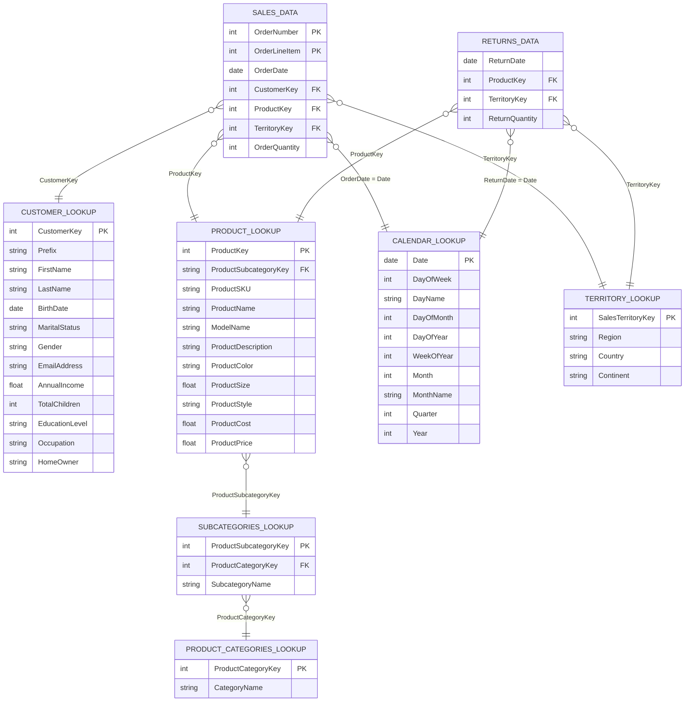

# Entity Relationship Diagram (ERD)
## Source CSV Files — Primary & Foreign Key Relationships

---

## Key Relationships Summary

| Source Table | Column | References | Column |
|-------------|--------|-----------|--------|
| Sales Data (2020–2022) | CustomerKey | Customer Lookup | CustomerKey |
| Sales Data (2020–2022) | ProductKey | Product Lookup | ProductKey |
| Sales Data (2020–2022) | TerritoryKey | Territory Lookup | SalesTerritoryKey |
| Sales Data (2020–2022) | OrderDate | Calendar Lookup | Date |
| Returns Data | ProductKey | Product Lookup | ProductKey |
| Returns Data | TerritoryKey | Territory Lookup | SalesTerritoryKey |
| Returns Data | ReturnDate | Calendar Lookup | Date |
| Product Lookup | ProductSubcategoryKey | Subcategories Lookup | ProductSubcategoryKey |
| Subcategories Lookup | ProductCategoryKey | Product Categories Lookup | ProductCategoryKey |

---

## Cardinality Notes

- `SALES_DATA` → `CUSTOMER_LOOKUP`: Many-to-one (one customer, many orders)
- `SALES_DATA` → `PRODUCT_LOOKUP`: Many-to-one (one product, many order lines)
- `RETURNS_DATA` → `PRODUCT_LOOKUP`: Many-to-one (one product, many returns)
- `PRODUCT_LOOKUP` → `SUBCATEGORIES_LOOKUP` → `PRODUCT_CATEGORIES_LOOKUP`: Many-to-one-to-one (category hierarchy)
