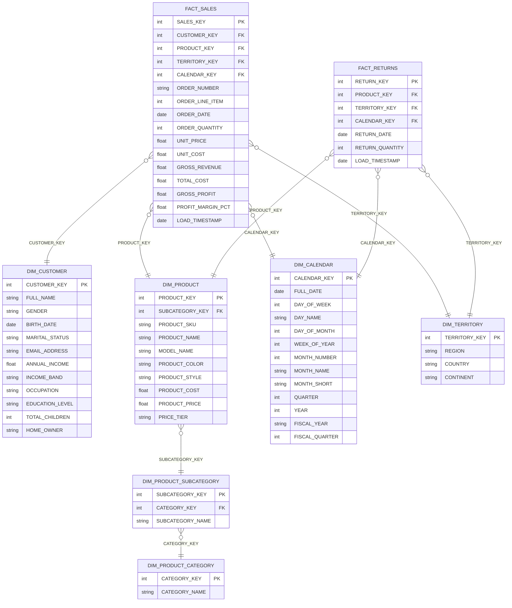

# Star Schema Diagram — Gold Layer
## Milestone 4: Gold Layer Star Schema



---

## Star Schema Overview

```
                    DIM_CALENDAR
                        |
DIM_CUSTOMER ——— FACT_SALES ——— DIM_TERRITORY
                        |
                    DIM_PRODUCT ——— DIM_PRODUCT_SUBCATEGORY ——— DIM_PRODUCT_CATEGORY

                    DIM_CALENDAR
                        |
         ——————————— FACT_RETURNS ——— DIM_TERRITORY
                        |
                    DIM_PRODUCT
```

---

## Grain Definitions

| Fact Table | Grain | Rows (approx) |
|-----------|-------|---------------|
| FACT_SALES | One row per order line item | ~56,000 |
| FACT_RETURNS | One row per product return | ~1,800 |

---

## Surrogate Key Strategy

All dimension tables use an integer surrogate key (`_KEY`) as the primary key.
Natural source keys are retained as separate columns for traceability.

| Dimension | Surrogate Key | Natural Key |
|-----------|--------------|-------------|
| DIM_CUSTOMER | CUSTOMER_KEY | (same as source) |
| DIM_PRODUCT | PRODUCT_KEY | PRODUCT_SKU |
| DIM_PRODUCT_SUBCATEGORY | SUBCATEGORY_KEY | (same as source) |
| DIM_PRODUCT_CATEGORY | CATEGORY_KEY | (same as source) |
| DIM_CALENDAR | CALENDAR_KEY | FULL_DATE |
| DIM_TERRITORY | TERRITORY_KEY | REGION + COUNTRY |

---

## Calculated Columns in FACT_SALES

| Column | Formula |
|--------|---------|
| GROSS_REVENUE | ORDER_QUANTITY × UNIT_PRICE |
| TOTAL_COST | ORDER_QUANTITY × UNIT_COST |
| GROSS_PROFIT | GROSS_REVENUE − TOTAL_COST |
| PROFIT_MARGIN_PCT | (GROSS_PROFIT / GROSS_REVENUE) × 100 |
